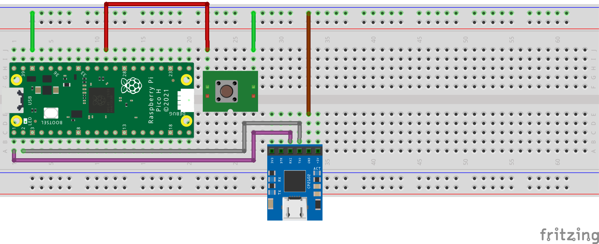

# Pi Pico command console from USB or UART with CP2102 USB-UART bridge

A demonstration of a simple command console on the Pi Pico via the built in 
USB port or through a USB-UART bridge written in C.

The Pi Pico can use the the USB port or UART pins for stdio character input 
and output. With stdio a command line can be programmed into the Pi Pico 
and a user can enter commands through one of the serial connections.

This demo uses a multicore application to setup a command prompt on the 
stdio serial port. The second Pi Pico core runs a process that reads input 
from stdio and echoes the characters back. When enter is received the process 
releases a semaphore to trigger the command processing thread.

The command processing thread runs on core0 and waits on a semaphore for 
a command string to process.

Two commands are provided in the demo application, "help" and "bootrom".
The help command will display a help message in the terminal and the 
bootrom command will reset the Pi Pico and boot into BOOTSEL mode.

## Prerequisites

- Pi Pico MCU
- USB-UART Bridge, (CP2102 based bridge used for demo)
- Breadboard with jumper wires
- USB cable to connect the Pi Pico to the workstation
- USB cable to connect the USB-UART bridge to the workstation
- Linux workstation (Fedora 37 used in the demo)
- Serial terminal application (screen, minicom, putty, etc.)

## Build

Assuming you already have a development environment setup as was used in the
previous pi-pico-linux-c projects then you can clone this repo, create a build 
directory, run cmake, then make, and lastly copy the resulting console.uf2 
file to the Pi Pico.

> git clone https://github.com/bnielsen1965/pi-pico-c-console.git

> cd pi-pico-c-console

> mkdir build

> cd build

*skip the export step if you already exported the pico-sdk path in your environment*
> export PICO_SDK_PATH=~/Embedded/pico-sdk/

> cmake ..

> make

*connect Pi Pico with USB cable and start with bootsel held down*
> cp console.uf2 /run/media/$(whoami)/RPI-RP2/

## Serial Connection

With the application saved to the Pi Pico connect the appropriate USB cable for 
the type of connection you are using, USB-UART or the build in USB port, and 
start your favored terminal application and bind to the correct tty device.

### USB Built In

The built in USB port on the Pi Pico can be used as a serial console by 
enabling stdio usb in the CMakeLists.txt file with the pico sdk macro 
function *pico_enable_stdio_usb*.

When connected to the workstation with a USB cable the /dev/ttyACM0 device 
should become available and can then be used with your favored serial 
terminal application.

**NOTE:** When using the "bootrom" command while connected on the built in 
USB port there may be a conflict because the serial terminal application is 
currently connected to the USB device and resetting the Pi Pico into BOOTSEL 
mode will attempt to change the USB device to Mass Storage.

Example using screen and the build in USB port:

> screen /dev/ttyACM0

[screencast_usb_console.webm](https://user-images.githubusercontent.com/486139/213902273-532058e8-13a0-41ad-a116-e26fb46ec687.webm)

### USB to UART

A USB to UART bridge can be used to connect a workstation to UART0 on the 
Pi Pico by hooking up a ground wire and the TX and RX lines from the 
USB-UART bridge to UART0 on the Pi Pico.

The USB-UART should show up as a /dev/ttyUSB# device when connected to 
the workstation, then use your favored serial terminal application.

Example using screen and a USB-UART connection:

> screen /dev/ttyUSB0 115200

[screencast_usb_uart_console.webm](https://user-images.githubusercontent.com/486139/213902513-57502eb4-6f8a-4d00-b795-98a7c7f43c24.webm)

## Reference Links

- Fedora Linux: [https://getfedora.org/](https://getfedora.org/)
- Raspberry Pi Pico: [https://www.raspberrypi.com/products/raspberry-pi-pico/](https://www.raspberrypi.com/products/raspberry-pi-pico/)
- Pi Pico SDK: [https://github.com/raspberrypi/pico-sdk](https://github.com/raspberrypi/pico-sdk)
- CP2102 based USB to UART: [Amazon search for "cp2102 USB to uart"](https://www.amazon.com/s?k=cp2102+USB+to+uart)

## Setup

The development environment used to create the demo is the same environment 
used in previous pi-pico-linux-c projects. Some brief instructions are 
included here to assist in setting up a new environment.

### Workstation Setup

The Linux workstation will require some software packages installed
before developing an application for the Pi Pico. You can use your
favored editor and terminal application, but you will also need *git*, *cmake*, and *g++*.

(Fedora 37 install command)

> sudo dnf install git cmake g++

The ARM cross compilers and libraries are also needed to compile 
and link binaries for the ARM processor on the Pi Pico.

(Fedora 37 install commands)

> sudo dnf install arm-none-eabi-gcc-cs

> sudo dnf install arm-none-eabi-gcc-cs-c++

> sudo dnf install arm-none-eabi-newlib

### Clone Pi Pico SDK

Create a project folder in your home directory where the work will be performed.
In this example we will be using the working directory named *Embedded*.

> cd ~

> mkdir Embedded

> cd Embedded

The Pi Pico SDK can be cloned from the raspberrypi github
repository.

(Clone pico-sdk project and update submodules)

> git clone https://github.com/raspberrypi/pico-sdk

> cd pico-sdk

> git submodule update --init

Return to the project directory and export the path 
environment variable for the pico-sdk.

> cd ..

> export PICO_SDK_PATH=~/Embedded/pico-sdk/
